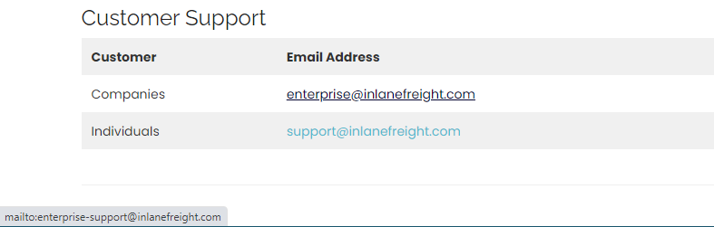

-----
# LOCATIONS
-----
1.  What are the city's coordinates where one of the company's offices, "inlanefreight.com" has its headquarters in Germany? (format: 00.0000 N, 0.0000 E)
 On the company website, `/offices` page, there's a paragraph mentioning offices in three different cities: Brighton, Oberhausen and Denver. We can look up their coordinates
 

> ***51.4878 N, 6.8633 E***

2. What are the city's coordinates where one of the company's offices, "inlanefreight.com" has its headquarters in United Kingdom? (format: 00.0000 N, 0.0000 W)
> ***50.8229 N, 0.1363 W***

3. What are the city's coordinates where one of the company's offices, "inlanefreight.com" has its headquarters in USA? (format: 00.0000 N, 000.0000 W)
> ***39.7392 N, 104.9903 W***

For the next two questions, answers can be found on `/about-us` page

4.  In which country is the chief financial officer located?
> ***Germany***

5.  How many locations does the company have in total? (format: <num>)
> ***14***

-----
# STAFF
-----
1. Check the website www.inlanefreight.com and find out the name of the chief operating officer and submit his full name as the answer.
 This can be found on `/about-us` page
> ***Max Cartmoon***

2. How many positions does the company Inlanefreight want to have filled in the future?
This can be found on `/career` page
> ***15***

3. How many logistics and software specialists does the Inlanefreight company employ at least?
This can be found on homepage
> ***40***

-----
# CONTACT INFORMATION
-----
1. Check the website www.inlanefreight.com and find out the email address of John Smith and submit it as the answer.
This can be found on `/contact` page

> ***john.smith4@inlanefreight.com***

2. What is the email address for enterprise customer support?
This one is tricky as `enterprise@inlanefreight.com` is considered incorrect answer. After careful inspect, I found the email to be a different one. I was able to obtain the correct email by hovering over the `enterprise@inlanefreight.com` email

> ***enterprise-support@inlanefreight.com***

-----
# BUSINESS RECORDS
-----
- Investigate the website www.inlanefreight.com and find out how much EBIT they recorded for the third quarter of 2020 and submit it as the answer. (Format example: GBP 000,000)
This can be found on `/news` page
> ***USD 276,000,000***

-----
# SERVICES
-----
1. Investigate the website www.inlanefreight.com and find out the name of the API application the company uses and submit it as the answer.
This can be found on the Home Page

> ***InlaneConnect***

2. How many liners does the company own in total?
This can be found on `/about-us` page

> ***72***

-----
# SOCIAL NETWORKS
-----
How many social networks are shown on the website of the company Inlanefreight?
> ***4***