-----
# PUBLIC DOMAIN RECORD
-----
1. Find out how many nameservers are responsible for the inlanefreight.com domain and submit the number as the answer.
- Run `dig ns inlanefreight.com` to find out the nameservers of inlanefreight.om

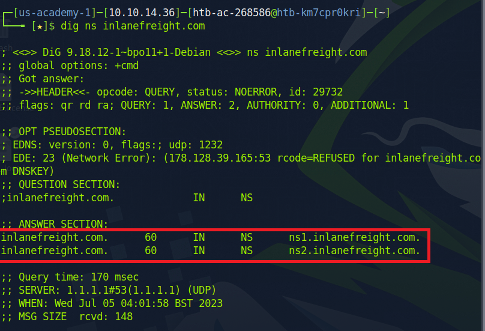

> ***2***

2.  Find out the FQDN of the mail server of the inlanefreight.com domain and submit it as the answer.
This information can be obtain from the  `host inlanefreight.com` command 


> ***mail1.inlanefreight.com***

3.  What is the registry domain ID of inlanefreight.com?
- This can be obtained by running 
```bash
whois inlanefreight.com
```

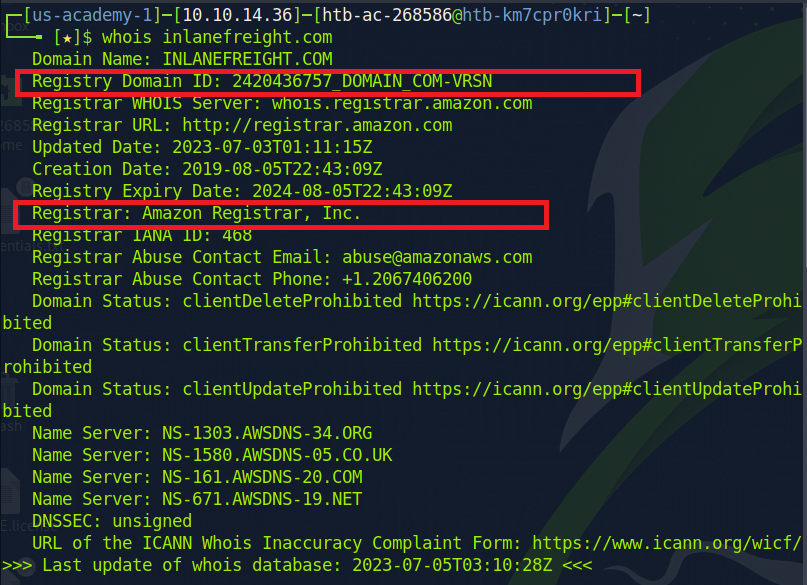

 > ***2420436757_DOMAIN_COM-VRSN***

4.  What is the name of the registrar of this domain?

> ***Amazon Registrar, Inc.***

5.  Examine the DNS records and submit the TXT record as the answer.
- Run the following command
```bash
dig txt inlanefreight.com
```

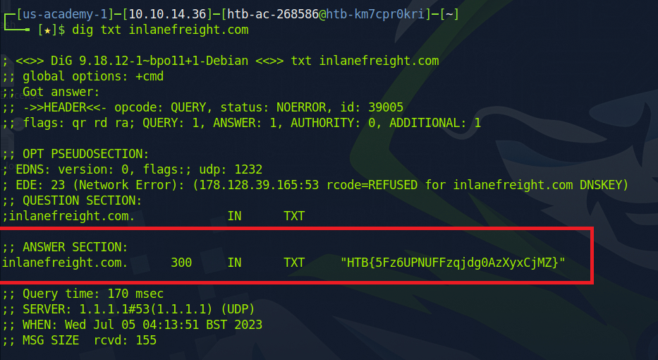

> ***HTB{5Fz6UPNUFFzqjdg0AzXyxCjMZ}***

-----
# DOMAIN STRUCTURE
-----

1. Investigate the website www.inlanefreight.com and find out the Apache version of the webserver and submit it as the answer. (Format: 0.0.00)
- Run a search on [Shodan](https://www.shodan.io/), we can obtain a lot of information about the company's domain structure

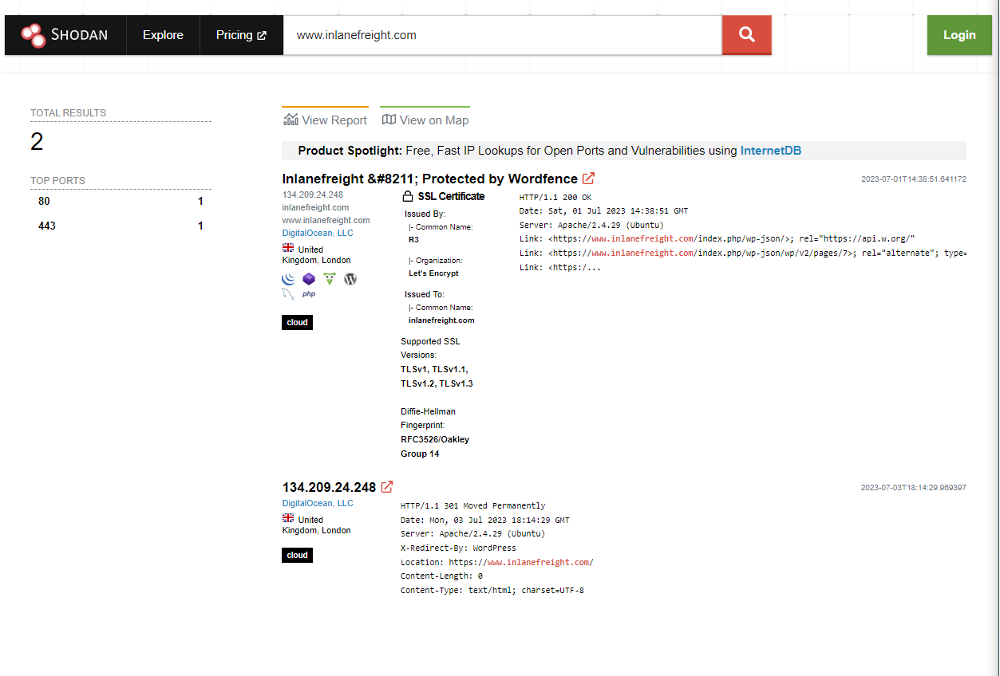

> ***2.4.29***

2. What is the hosting provider for the inlanefreight.com domain?

> ***DigitalOcean, LLC (DO-13)

3.  What is the ASN for the inlanefreight.com domain?
- Run `whois` command on the inlanefreight.com's IP to obtain the ASN
```bash
whois 134.209.24.248
```

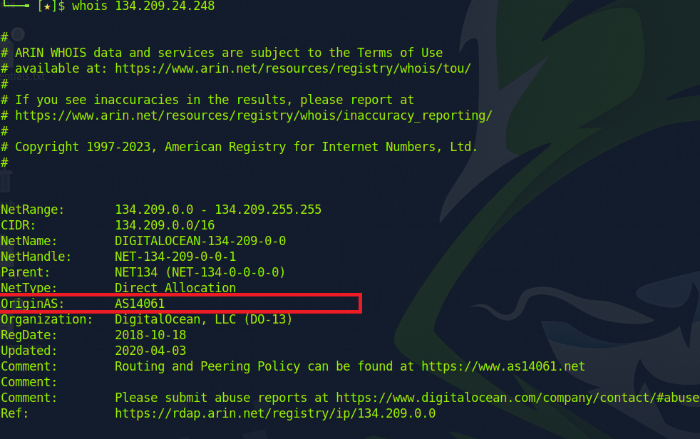

> AS14061

4.  On which operating system is the webserver www.inlanefreight.com running?

> ***Ubuntu***

5. How many JS resources are there on the Inlanefreight website?
- Run a search on [SEOptimer.](https://www.seoptimer.com/)
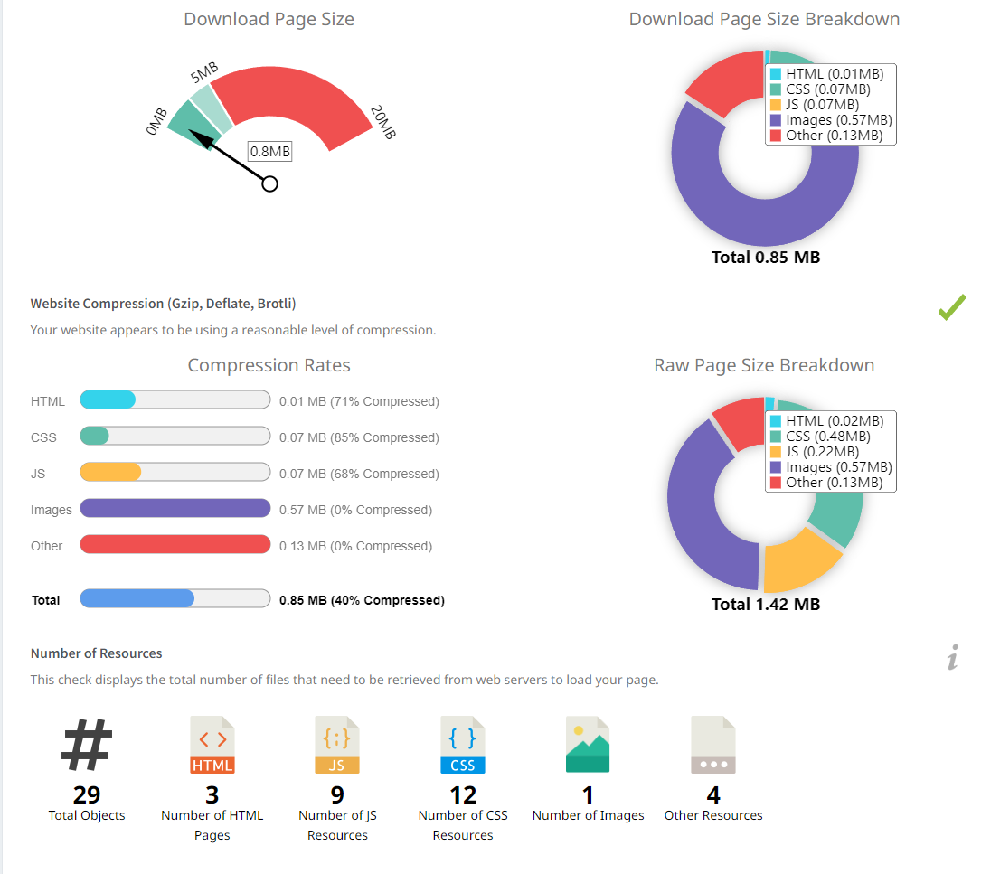

> ***9***


-----
# CLOUD STORAGE
-----
1. Investigate the website and find the bucket name of AWS that the company used and submit it as the answer. (Format: sub.domain.tld)
- Inspect the `Inlanefreight-Goals` file on `/news` page, we'll see the cloud storage used.

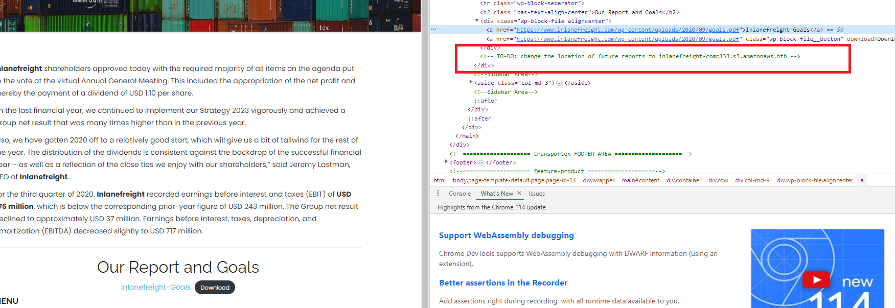

> ***inlanefreight-comp133.s3.amazonaws.htb***


-----
# Email Adress
-----
What is the email address of the CEO?

- Inspect the `/about-us` page, we'll see the ceo's email

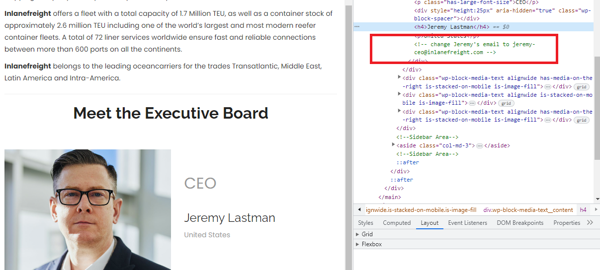

> ***jeremy-ceo@inlanefreight.com***

-----
# THIRD PARTIES
-----
1. Investigate the website www.inlanefreight.com and find out which cloud provider the company most likely focuses on and submit it as the answer.
- From the previous question in **Cloud Storage** section, we can tell they're using AWS

> ***AWS***


-----
# TECHNOLOGIES IN USE
-----
1. Which version of WordPress is used on the Inlanefreight domain page?
- Using `Wappalyzer`, we see the website is using Wordpress 5.6.11


- However, consider the time of this module, the correct answer is 5.6.10. We can confirm this by checking `www.inlanefreight.com` older versions on archive.org

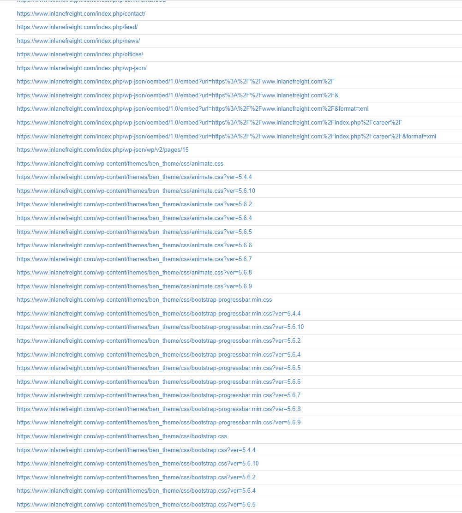
- Even though we see multiple versions of Wordpress, it is evident the company always updates WordPress (based on the Wappalyzer output). Therefore, we can safely assume that the WP version is 5.6.10

> ***5.6.10***

2. What is the name of the theme that is used on the WordPress site?
- From the above screenshot, we have

> ***ben_theme***

3.  Which WAF is being used? (Format: <name>)
- Run a search on [shodan](https://shodan.io), I found the company was using Wordfence WAF


- This can be confirmed on [SEOptimer](https://seoptimer.com)
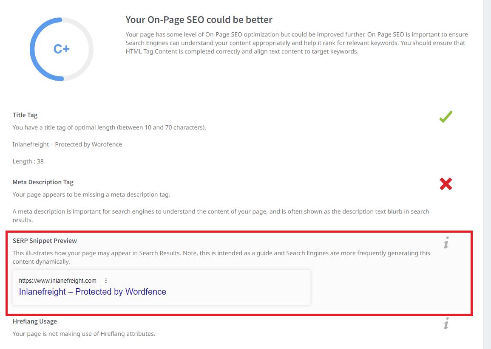

> ***Wordfence***


-----
# INTERNAL LEAKS
-----
1. Investigate the website www.inlanefreight.com and try to find any additional information that a file might contain and submit the found flag as the answer.

On the `/news` page, there is a downloadable file called `Inlanefreight-Goals`. Download the file and run `exiftool` command to extract its information.
```bash
exiftool goals.pdf
```

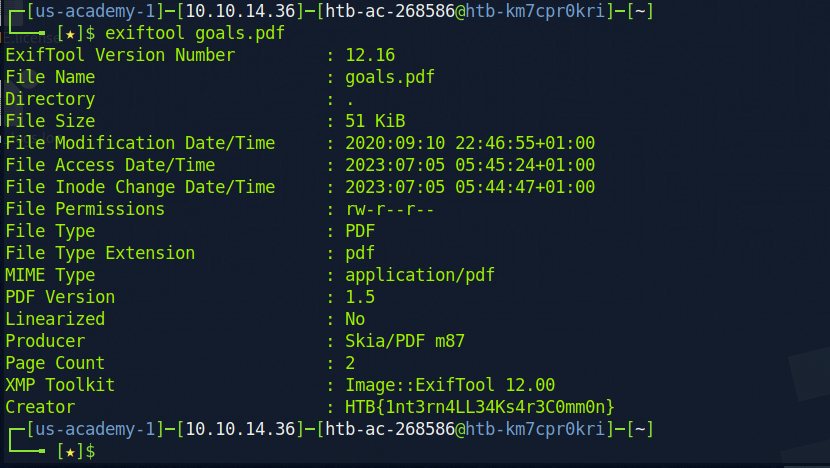

> ***HTB{1nt3rn4LL34Ks4r3C0mm0n}***